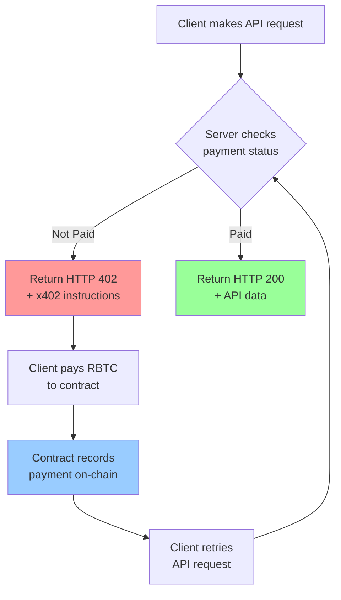
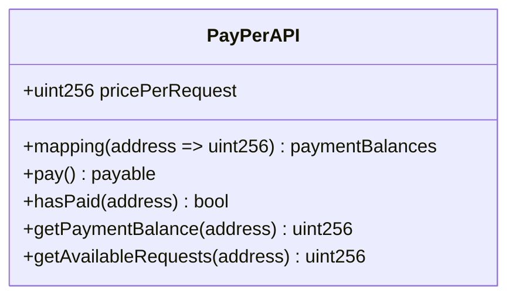

# x402 Pay-Per-API on Rootstock

A complete implementation of pay-per-request APIs using the **x402 payment standard** on **Rootstock (RBTC)**, enabling Bitcoin-secured, permissionless API monetization.

## 🎯 Overview

This project demonstrates how to build a pay-per-request API system where:
- Clients make API requests
- Server responds with **HTTP 402 Payment Required** if not paid
- Clients pay **RBTC** on Rootstock blockchain
- Server verifies payment on-chain and serves the API response

### Key Features

- ✅ **x402 Payment Standard** - HTTP 402 Payment Required responses
- ✅ **Bitcoin-Secured** - Payments secured by Rootstock (Bitcoin merge-mining)
- ✅ **Trustless** - No databases, no payment processors, pure blockchain verification
- ✅ **Permissionless** - Any wallet can pay, no accounts or API keys needed
- ✅ **EVM Compatible** - Uses familiar Ethereum tooling (Solidity, viem)
- ✅ **Low Fees** - Much cheaper than Bitcoin L1

## 📁 Project Structure

```
x402-rootstock-pay-per-api/
├── contracts/          # Solidity smart contracts (Foundry)
│   ├── src/           # PayPerAPI.sol contract
│   ├── test/          # Foundry tests
│   └── script/        # Deployment scripts
├── backend/           # Node.js Express API server
│   ├── config/        # Rootstock & viem configuration
│   ├── middleware/    # x402 payment middleware
│   └── examples/      # Example clients & scripts
└── README.md          # This file
```

## 🚀 Quick Start

### Prerequisites

- **Node.js 18+** (for backend)
- **Foundry** (for smart contracts)
- **RBTC on Rootstock Testnet** (for testing)

### Step 1: Deploy Smart Contract

```bash
cd contracts
forge build
forge test
forge script script/DeployPayPerAPI.s.sol:DeployPayPerAPI \
  --rpc-url $ROOTSTOCK_TESTNET_RPC_URL \
  --private-key $PRIVATE_KEY \
  --broadcast --legacy
```

See [contracts/README.md](./contracts/README.md) for detailed deployment instructions.

### Step 2: Setup Backend

```bash
cd backend
npm install
cp .env.example .env
# Edit .env with your contract address
npm start
```

See [backend/README.md](./backend/README.md) for detailed setup.

### Step 3: Test the Flow

```bash
# Make request (will get HTTP 402)
curl -H "x-wallet-address: 0xYourAddress" \
  http://localhost:3000/api/data

# Make payment (using example script)
node examples/make-payment.js

# Retry request (should get data)
curl -H "x-wallet-address: 0xYourAddress" \
  http://localhost:3000/api/data
```

## 🔄 Complete Payment Flow



## 💡 What is x402?

**x402** is an open standard for internet-native payments that:
- Uses **HTTP 402 Payment Required** status code
- Provides structured payment instructions in the response
- Enables programmatic, crypto-native API monetization
- Works seamlessly with blockchain payments

### Why HTTP 402?

HTTP 402 was reserved in the original HTTP specification for payment-required scenarios but was never standardized. x402 brings this status code to life for crypto payments.

## 🌐 Why Rootstock?

**Rootstock** is perfect for x402 because:

- ✅ **Bitcoin Security** - Secured by Bitcoin's hash power (merge-mining)
- ✅ **EVM Compatible** - Use familiar Ethereum tools (Solidity, viem, MetaMask)
- ✅ **Low Fees** - Much cheaper than Bitcoin L1
- ✅ **Smart Contracts** - Full programmability for payment logic
- ✅ **Fast Confirmations** - Faster than Bitcoin L1

## 📊 System Components

### 1. Smart Contract (`contracts/src/PayPerAPI.sol`)



**Responsibilities:**
- Accept RBTC payments
- Track payments per address
- Provide payment verification functions

### 2. Backend API (`backend/server.js`)

**Endpoints:**
- `GET /health` - Health check (no payment)
- `GET /api/data` - Protected data (requires payment)
- `GET /api/weather` - Weather API (requires payment)
- `POST /api/ai/infer` - AI inference (requires payment)
- `GET /api/payment/status` - Check payment status

### 3. Payment Middleware (`backend/middleware/x402Payment.js`)

**Flow:**
1. Extract wallet address from request header
2. Query smart contract for payment status
3. Return HTTP 402 with x402 instructions if not paid
4. Allow request to proceed if paid

## 🔐 Security Considerations

- ✅ **Trustless Verification** - Payments verified on-chain, not in database
- ✅ **No API Keys** - Wallet address is the identity
- ✅ **Immutable Records** - Payment history stored on blockchain
- ✅ **No Centralized Control** - Contract is decentralized
- ⚠️ **Rate Limiting** - Consider adding for production
- ⚠️ **HTTPS Required** - Always use HTTPS in production

## 🧪 Testing

### Smart Contract Tests
```bash
cd contracts
forge test
```

### Backend Tests
```bash
cd backend
# Start server
npm start

# In another terminal
curl -H "x-wallet-address: 0xYourAddress" \
  http://localhost:3000/api/data
```

### Full Flow Test
```bash
cd backend
node examples/make-payment.js
curl -H "x-wallet-address: 0xYourAddress" \
  http://localhost:3000/api/data
```

## 📚 Documentation

- **[contracts/README.md](./contracts/README.md)** - Smart contract deployment & usage
- **[backend/README.md](./backend/README.md)** - Backend API setup & usage
- **[x402 Documentation](https://x402.gitbook.io/x402)** - x402 standard specification
- **[Rootstock Docs](https://developers.rsk.co/)** - Rootstock network documentation

## 🌍 Network Information

### Rootstock Testnet
- **Chain ID:** 31
- **RPC URL:** `https://public-node.testnet.rsk.co`
- **Explorer:** `https://explorer.testnet.rootstock.io`
- **Faucet:** `https://faucet.testnet.rsk.co`

### Rootstock Mainnet
- **Chain ID:** 30
- **RPC URL:** `https://public-node.rsk.co`
- **Explorer:** `https://explorer.rsk.co`

## 🛠️ Tech Stack

### Smart Contracts
- **Solidity** ^0.8.20
- **Foundry** - Development framework
- **Rootstock** - Blockchain network

### Backend
- **Node.js** 18+
- **Express** - Web framework
- **viem** - Ethereum/Rootstock client library
- **dotenv** - Environment configuration

## 📈 Use Cases

- **AI Inference APIs** - Pay per inference request
- **Data Feeds** - Premium cryptocurrency data
- **Analytics Services** - On-demand analytics
- **Microservices** - Internal service monetization
- **Premium Content** - Pay-per-article access

## 🤝 Contributing

This is a tutorial/example project. Feel free to:
- Fork and modify for your needs
- Improve documentation
- Add additional features
- Share your implementations

## 📄 License

MIT

## 🙏 Acknowledgments

- **x402** - Payment standard specification
- **Rootstock** - Bitcoin-secured smart contract platform
- **Foundry** - Development framework
- **viem** - Type-safe Ethereum library

---

## 🚀 Next Steps

1. **Deploy Contract** - See [contracts/README.md](./contracts/README.md)
2. **Setup Backend** - See [backend/README.md](./backend/README.md)
3. **Test Flow** - Make payment and verify API access
4. **Customize** - Adapt to your specific use case
5. **Deploy** - Move to production on Rootstock mainnet

For detailed instructions, see the README files in each folder.

