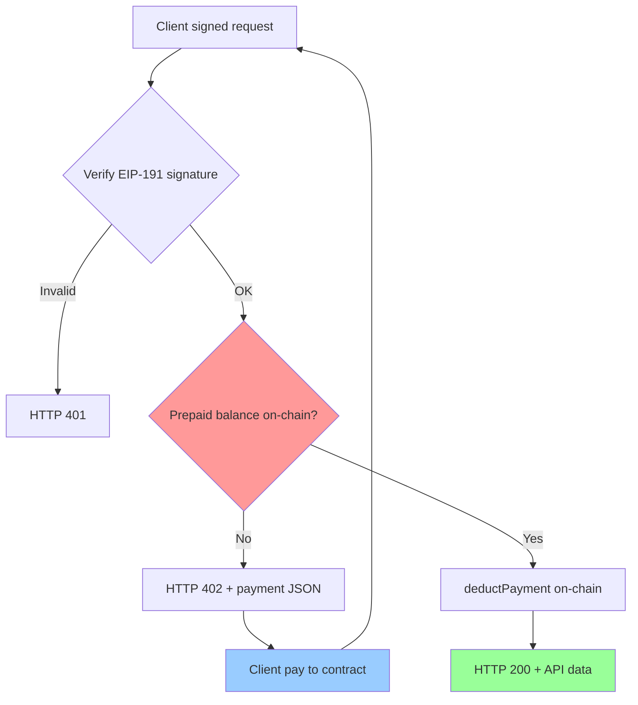
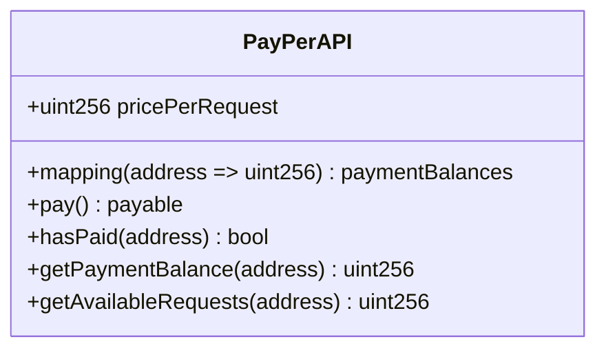

# x402 Pay-Per-API on Rootstock

A **prepaid, pay-per-request** API demo on **Rootstock (RBTC)**. It uses **HTTP 402** and **x402-style JSON** for payment instructions, plus **on-chain balance checks** and **per-request `deductPayment`** so each successful call consumes credit. **Wallet ownership** is proven with **EIP-191 signed headers** (not spoofable via `x-wallet-address` alone).

## Positioning (read before publishing)

- **HTTP 402 + payment metadata**: aligned with the *spirit* of [x402](https://x402.gitbook.io/x402); response shape is x402-style, not a claim of full spec compliance.
- **Auth**: custom **signature headers** are an **extension** for this tutorial — they are not part of the core x402 spec.
- **Enforcement**: the server **must** hold `OWNER_PRIVATE_KEY` (contract owner) to call `deductPayment` after verification; without deduction, “pay per request” is not enforced.

## 🎯 Overview

This project demonstrates how to build a pay-per-request API system where:
- Clients make API requests with **signed auth headers** and `x-wallet-address`
- Server responds with **HTTP 402 Payment Required** if prepaid balance is insufficient
- Clients pay **RBTC** into the contract (`pay()`)
- Server verifies balance **on-chain**, **deducts one request** via `deductPayment`, then serves the response

### Key Features

- ✅ **HTTP 402** — Payment required responses with structured payment hints (x402-style)
- ✅ **Bitcoin-secured RBTC** — Rootstock (merge-mined with Bitcoin)
- ✅ **On-chain verification** — No DB for balances; reads come from the contract
- ✅ **Per-request deduction** — `deductPayment` runs before the route handler (not optional)
- ✅ **Wallet ownership** — EIP-191 `personal_sign` over a canonical message (see `GET /api/auth/spec`)
- ✅ **EVM compatible** — Solidity + viem + Foundry
- ✅ **Low fees** — Suitable for small RBTC amounts per request

## 📁 Project Structure

```
x402-rootstock-pay-per-api/
├── contracts/          # Solidity smart contracts (Foundry)
│   ├── src/           # PayPerAPI.sol contract
│   ├── test/          # Foundry tests
│   └── script/        # Deployment scripts
├── backend/           # Node.js Express API server
│   ├── config/        # Rootstock & viem configuration
│   ├── middleware/    # x402 payment middleware
│   └── examples/      # Example clients & scripts
└── README.md          # This file
```

## 🚀 Quick Start

### Prerequisites

- **Node.js 18+** (for backend)
- **Foundry** (for smart contracts)
- **RBTC on Rootstock Testnet** (for testing)

### Step 1: Deploy Smart Contract

```bash
cd contracts
forge build
forge test
forge script script/DeployPayPerAPI.s.sol:DeployPayPerAPI \
  --rpc-url $ROOTSTOCK_TESTNET_RPC_URL \
  --private-key $PRIVATE_KEY \
  --broadcast --legacy
```

See [contracts/README.md](./contracts/README.md) for detailed deployment instructions.

### Step 2: Setup Backend

```bash
cd backend
npm install
cp .env.example .env
# Edit .env with your contract address
npm start
```

See [backend/README.md](./backend/README.md) for detailed setup.

### Step 3: Test the Flow

Protected routes require **signed headers**. Use the example client (or `GET /api/auth/spec` for the exact format).

```bash
cd backend
# See signing format (server must be running)
curl -s http://localhost:3000/api/auth/spec | head

# Pay into contract (payer key)
node examples/make-payment.js

# Call API with signatures (see .env: SIGNER_PRIVATE_KEY, WALLET_ADDRESS)
npm run test-client

# Optional: print a signed message locally for reviewers
npm run demonstrate-auth
```

## 🔄 Complete Payment Flow


```mermaid
flowchart TD
    A[Client signed request] --> B{Verify EIP-191 signature}
    B -->|Invalid| Z[HTTP 401]
    B -->|OK| C{Prepaid balance on-chain?}
    C -->|No| D[HTTP 402 + payment JSON]
    D --> E[Client pay to contract]
    E --> A
    C -->|Yes| F[deductPayment on-chain]
    F --> G[HTTP 200 + API data]
    
    style C fill:#ff9999
    style G fill:#99ff99
    style E fill:#99ccff
```

## 💡 What is x402?

**x402** is an open standard for internet-native payments that:
- Uses **HTTP 402 Payment Required** status code
- Provides structured payment instructions in the response
- Enables programmatic, crypto-native API monetization
- Works seamlessly with blockchain payments

### Why HTTP 402?

HTTP 402 was reserved in the original HTTP specification for payment-required scenarios but was never standardized. x402 brings this status code to life for crypto payments.

## 🌐 Why Rootstock?

**Rootstock** is perfect for x402 because:

- ✅ **Bitcoin Security** - Secured by Bitcoin's hash power (merge-mining)
- ✅ **EVM Compatible** - Use familiar Ethereum tools (Solidity, viem, MetaMask)
- ✅ **Low Fees** - Much cheaper than Bitcoin L1
- ✅ **Smart Contracts** - Full programmability for payment logic
- ✅ **Fast Confirmations** - Faster than Bitcoin L1

## 📊 System Components

### 1. Smart Contract (`contracts/src/PayPerAPI.sol`)


```mermaid
classDiagram
    class PayPerAPI {
        +uint256 pricePerRequest
        +mapping(address => uint256) paymentBalances
        +pay() payable
        +hasPaid(address) bool
        +getPaymentBalance(address) uint256
        +getAvailableRequests(address) uint256
    }
```

**Responsibilities:**
- Accept RBTC payments
- Track payments per address
- Provide payment verification functions

### 2. Backend API (`backend/server.js`)

**Endpoints:**
- `GET /health` - Health check (no payment)
- `GET /api/auth/spec` - Wallet signing format (no payment)
- `GET /api/data` - Protected (signature + prepaid deduct)
- `GET /api/weather` - Protected (signature + prepaid deduct)
- `POST /api/ai/infer` - Protected (signature + prepaid deduct)
- `GET /api/payment/status` - Balance check (signature required)

### 3. Payment Middleware (`backend/middleware/x402Payment.js`)

**Flow:**
1. Read `x-wallet-address` and verify EIP-191 signature (`x-auth-*` headers)
2. Read prepaid balance from the contract; if insufficient, return HTTP 402 (x402-style JSON)
3. If sufficient, submit `deductPayment(payer, pricePerRequest)`, wait for receipt, confirm balance decreased
4. Call `next()` so the route handler runs only after deduction succeeds

## 🔐 Security Considerations

- ✅ **On-chain balances** — Reads and deductions go through the contract
- ✅ **Wallet ownership** — Requests must carry a valid signature for `x-wallet-address`
- ✅ **Per-request deduction** — Owner key on server (`OWNER_PRIVATE_KEY`) required; protect it like production secrets
- ⚠️ **Not “trustless” toward the API operator** — The server controls deduction timing and holds the owner key; clients still verify payments on-chain
- ⚠️ **Rate limiting / HTTPS** — Use in production

## 🧪 Testing

### Smart Contract Tests
```bash
cd contracts
forge test
```

### Backend Tests
```bash
cd backend
npm start

# In another terminal
npm run test-client
```

### Full Flow Test
```bash
cd backend
node examples/make-payment.js
npm run test-client
```

## 📚 Documentation

- **[contracts/README.md](./contracts/README.md)** - Smart contract deployment & usage
- **[backend/README.md](./backend/README.md)** - Backend API setup & usage
- **[x402 Documentation](https://x402.gitbook.io/x402)** - x402 standard specification
- **[Rootstock Docs](https://developers.rsk.co/)** - Rootstock network documentation

## 🌍 Network Information

### Rootstock Testnet
- **Chain ID:** 31
- **RPC URL:** `https://public-node.testnet.rsk.co`
- **Explorer:** `https://explorer.testnet.rootstock.io`
- **Faucet:** `https://faucet.testnet.rsk.co`

### Rootstock Mainnet
- **Chain ID:** 30
- **RPC URL:** `https://public-node.rsk.co`
- **Explorer:** `https://explorer.rsk.co`

## 🛠️ Tech Stack

### Smart Contracts
- **Solidity** ^0.8.20
- **Foundry** - Development framework
- **Rootstock** - Blockchain network

### Backend
- **Node.js** 18+
- **Express** - Web framework
- **viem** - Ethereum/Rootstock client library
- **dotenv** - Environment configuration

## 📈 Use Cases

- **AI Inference APIs** - Pay per inference request
- **Data Feeds** - Premium cryptocurrency data
- **Analytics Services** - On-demand analytics
- **Microservices** - Internal service monetization
- **Premium Content** - Pay-per-article access

## 🤝 Contributing

This is a tutorial/example project. Feel free to:
- Fork and modify for your needs
- Improve documentation
- Add additional features
- Share your implementations

## 📄 License

MIT

## 🙏 Acknowledgments

- **x402** - Payment standard specification
- **Rootstock** - Bitcoin-secured smart contract platform
- **Foundry** - Development framework
- **viem** - Type-safe Ethereum library

---

## 🚀 Next Steps

1. **Deploy Contract** - See [contracts/README.md](./contracts/README.md)
2. **Setup Backend** - See [backend/README.md](./backend/README.md)
3. **Test Flow** - Make payment and verify API access
4. **Customize** - Adapt to your specific use case
5. **Deploy** - Move to production on Rootstock mainnet

For detailed instructions, see the README files in each folder.

